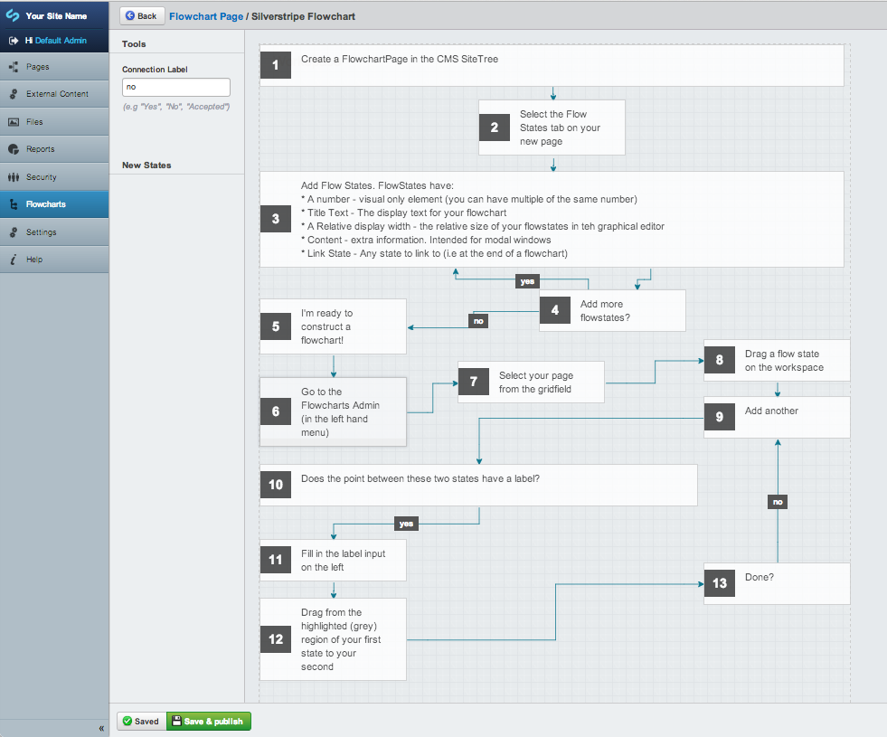
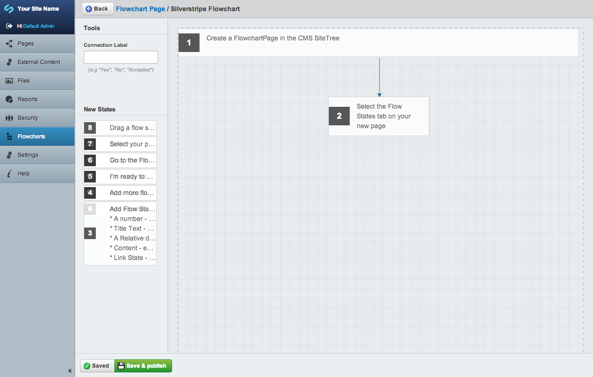

#Silverstripe Flowchart

Implementation of JSPlumb to create and store graphical flowcharts within SilverStripe

## Built with JSPlumb

http://jsplumbtoolkit.com/

## Approach
1. Enter data in a gridfield on the FlowchartPage type
2. Manually construct drawings with that data in a ModelAdmin

##Set up
Use composer to install via Packagist or clone repo. The module name should be flowchart.
Run dev/build?flush=all.

(Note: if the modale admin appears broken, you may need to run flush=all from within the admin (module overrides edit form within a gridfield.)

##Screen Shots

